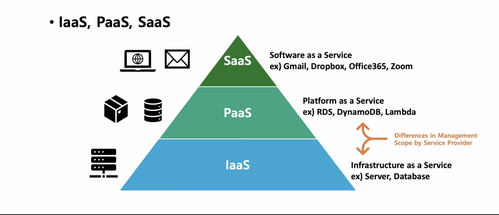
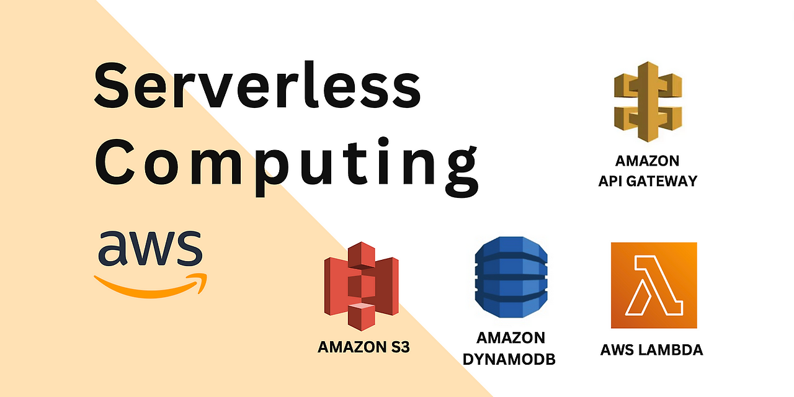
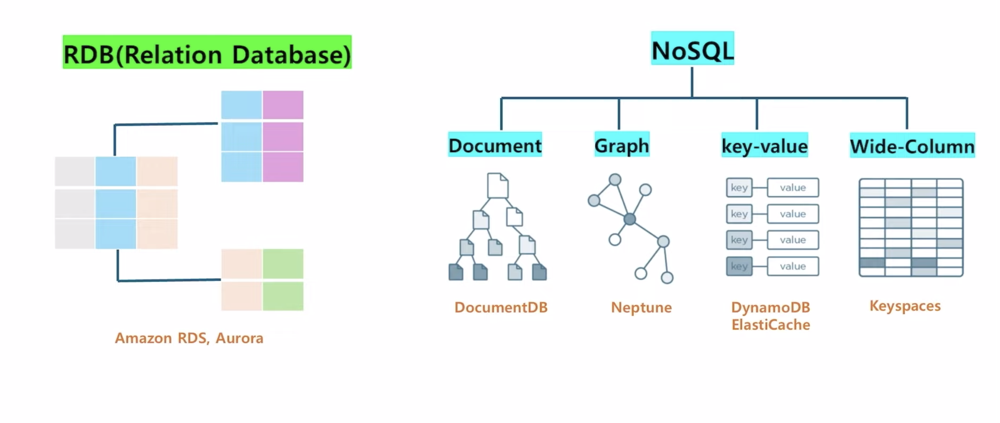

 <h2>On-demand</h2>

 사용자가 필요할 때 즉시 이용할 수 있는 서비스나 제품을 제공하는 방식을 의미.

이는 특정 시간이나 장소에 구애받지 않고 사용자 요청에 따라 즉각적으로 제공되는 형태

## **On-demand `주요 특징`**

1. **즉시성**: 사용자가 요청하면 바로 서비스를 제공
2. **유연성**: 사용자가 원하는 시간과 장소에서 이용 가능
3. **개인화**: 사용자 요구에 맞춘 맞춤형 서비스 제공

## **On-demand `예시`**

- **스트리밍 서비스**: 넷플릭스, 유튜브 등에서 원하는 콘텐츠를 실시간으로 시청.
- **배달 서비스**: 배달의민족, 우버이츠와 같은 음식 배달 플랫폼.
- **차량 호출 서비스**: 우버, 카카오택시 등.
- **클라우드 컴퓨팅**: AWS, Google Cloud에서 필요한 만큼의 컴퓨팅 자원을 즉시 활용.

  - ✅ Auto Scaling
  - ✅ Load Balancing
----
 

 <h2>Virtualization</h2>

 가상화는 물리적인 IT 자원을 추상화하여 논리적인 자원으로 분리하고 관리하는 기술을 의미

이를 통해 하나의 물리적 하드웨어에서 여러 개의 가상 시스템을 실행하거나,

 여러 자원을 하나로 통합하여 효율적으로 사용가능

## **Virtualization `주요 특징`**

1. **자원 효율성**: 물리적 자원을 최대로 활용하여 비용 절감.
2. **유연성**: 필요에 따라 자원을 동적으로 할당하거나 조정 가능.
3. **격리성**: 각 가상 환경이 독립적으로 실행되어 보안성과 안정성 강화.
4. **확장성**: 클라우드 환경에서 손쉽게 확장 가능.

## **Virtualization `예시`**

- **하이퍼바이저(Hypervisor)**:  

  - 베어메탈 : VMware ESXi, Microsoft Hyper-V  
  - 호스트 기반 : Oracle VirtualBox, VMware Workstation  

 

- **가상 머신(Virtual Machine)**:  

  - 독립적인 운영체제와 애플리케이션 실행 환경 제공.  

 

- **컨테이너(Container)**:  

  - 경량화된 가상화 기술로, Docker, Kubernetes 등이 대표적.  

 

- **클라우드 컴퓨팅**:  
  - AWS, Azure, Google Cloud와 같은 플랫폼에서 가상 서버 제공.  

    - ✅ **IaaS (Infrastructure as a Service)**  
    - ✅ **PaaS (Platform as a Service)**  
    - ✅ **SaaS (Software as a Service)**  
----
 

 <h2>Public Cloud & Private Cloud</h2>

 클라우드 환경은 **Public Cloud**와 **Private Cloud**로 나뉘며, 각기 다른 특징과 용도를 가짐

.png>)

 

## **Public Cloud** 

- **정의**:  

  제3자 클라우드 서비스 제공업체가 IT 자원(컴퓨팅, 스토리지, 네트워킹 등)을
  
   인터넷을 통해 여러 사용자(다중 테넌트)에게 공유하는 형태의 클라우드 환경 
     

- **주요 특징**:  

  1. **공유 인프라**  
     - 여러 사용자가 동일한 물리적 하드웨어를 공유하지만, 데이터는 논리적으로 분리됨.  

  2. **확장성**  
     - 필요에 따라 자원을 빠르게 확장하거나 축소 가능.  

  3. **비용 효율성**  
     - 초기 투자 비용이 낮고, 사용량 기반 종량제(pay-as-you-go) 요금제 제공.  

  4. **관리 책임**  
     - 클라우드 제공업체가 인프라 관리 및 유지보수를 담당.  

-----

.png>)

- **예시**: 
 
  - ✅ AWS (Amazon Web Services)  
  - ✅  Microsoft Azure  
  - ✅  Google Cloud Platform (GCP)  

 

## **Private Cloud**

- 특수한 관리를 위해 설계된 클라우드 환경으로, 모든 하드웨어와 소프트웨어 자원이

    단일 사용자(싱글 테넌트)에게 전용으로 제공

- **주요 특징**:  

  1. **전용 인프라**  
     - 하나의 조직만이 자원을 사용하며, 보안과 제어 수준이 높음.  

  2. **맞춤화 가능**  
     - 조직의 요구에 맞게 하드웨어, 소프트웨어, 네트워크를 구성 가능.  

  3. **보안 강화**  
     - 데이터 프라이버시와 보안 & 규제 준수 요구사항 충족 가능
     
---

- **오해하면 안 되는 개념**:  

  Private Cloud라고 해서 반드시 `On-Premise` 환경만을 뜻하는 것은 아님.
  
  외부 클라우드 제공업체(AWS, GCP, NCP)를 통해 Private한 설계 가능

  - **예시**: 
 
  - ✅ AWS (Amazon Web Services)  
  - ✅  Microsoft Azure  
  - ✅  Google Cloud Platform (GCP)  
  - ✅  On-premise

 <h2>AWS 3-Tier Architecture</h2>

 웹 애플리케이션을 구성하는 표준적인 아키텍처로, 프레젠테이션 계층, 로직 계층, 데이터 계층으로 나눔
 
 각 계층은 독립적으로 작동하며, 서로 다른 역할을 수행

## **프레젠테이션 계층 (Presentation Tier)**

.png>)

- **정의**:  
  사용자가 직접 상호작용하는 구성 요소로, 주로 사용자 인터페이스를 지원하며 GUI 또는 Front-End라고도 불림
     

- **주요 특징**:  

  1. **사용자 인터페이스**  
     - 사용자와의 직접적인 상호작용을 담당하며, Web Server, HTML, JavaScript, CSS 등이 포함됨.

  2. **로직 비포함**  
     - 사용자 인터페이스와 관계없는 데이터를 처리하는 로직은 포함하지 않음.

- **예시**:  
  - ✅ Web Server (Apache, Nginx)
  - ✅ HTML/CSS/JavaScript
  - ✅ React, Angular, Vue.js

-----

## **로직 계층 (Logic Tier)**

- **정의**:  
  사용자 작업을 애플리케이션 기능으로 변환하는데 필요한 코드로, 비즈니스 로직을 처리하는 핵심 계층.
     

- **주요 특징**:  

  1. **비즈니스 로직 처리**  
     - CRUD 데이터베이스 작업 및 데이터 처리를 담당하며, 서버 측 스크립트, API 등이 포함됨.

  2. **애플리케이션 기능 변환**  
     - 사용자 요청을 실제 애플리케이션 기능으로 변환.

- **예시**:  
  - ✅ Application Server (Node.js, Django, Spring)
  - ✅ API Gateway
  - ✅ Lambda Functions

-----

## **데이터 계층 (Data Tier)**

- **정의**:  
  애플리케이션과 관련된 데이터를 보관하는 스토리지 미디어로, 데이터의 영속성과 일관성을 보장.
     

- **주요 특징**:  

  1. **데이터 저장 및 관리**  
     - 데이터베이스, 객체 스토어, 캐시 및 파일 시스템을 포함하여 데이터를 저장하고 관리.

  2. **데이터 일관성 보장**  
     - 데이터의 영속성과 일관성을 보장하며, SQL/NoSQL 데이터베이스, 파일 스토리지, 캐시 시스템 등이 포함됨.

- **예시**:  
  - ✅ RDS (MySQL, PostgreSQL)
  - ✅ DynamoDB
  - ✅ S3, EFS

----
 

<h2>Serverless</h2>

서버리스 컴퓨팅은 클라우드 컴퓨팅의 한 모델로, 개발자가 서버를 직접 관리하지 않고

 애플리케이션을 구축하고 실행할 수 있도록 지원하는 방식

 

## **Serverless `주요 특징`**

1. **인프라 관리 불필요**:  
   - 서버 프로비저닝, 유지보수, 확장 등을 클라우드 제공업체가 처리.

2. **온디맨드 실행**:  
   - 애플리케이션이 호출될 때만 실행되며, 유휴 상태에서는 비용이 발생하지 않음.  
3. **자동 확장성**:  
   - 트래픽 증가 시 자동으로 리소스를 확장하여 대응 가능.  
4. **비용 효율성**:  
   - 사용한 만큼만 비용을 지불하는 종량제 방식.

 

## **Serverless `예시`**

- **Function as a Service (FaaS)**:  
  - AWS Lambda, Google Cloud Functions, Azure Functions 등 이벤트 기반의 함수 실행 서비스.

- **Backend as a Service (BaaS)**:  
  - Firebase, AWS Amplify 등 인증, 데이터베이스, 스토리지 등의 백엔드 기능 제공.
- **API Gateway**:  
  - AWS API Gateway와 같은 서비스로 API 요청을 관리하고 라우팅.

 

## **Serverless `장점`**

1. **개발 생산성 향상**:  
   - 인프라 관리 부담이 줄어들어 개발 속도가 빨라짐.  

2. **비용 절감**:  
   - 사용한 만큼만 비용을 지불하므로 유휴 리소스 비용이 없음.  
3. **빠른 배포**:  
   - DevOps 작업이 간소화되어 애플리케이션 배포 시간이 단축됨.  

 

## **Serverless `단점 및 한계`**

1. **초기 호출 지연(Cold Start)**:  
   - 함수가 처음 호출될 때 지연 시간이 발생할 수 있음. 

2. **벤더 종속성(Vendor Lock-in)**:  
   - 특정 클라우드 제공업체의 기술에 의존하게 될 가능성 존재.  
3. **복잡한 디버깅 및 모니터링**:  
   - 분산된 환경에서 문제를 추적하거나 디버깅하는 데 어려움이 있음.

 

## **Serverless `적용 사례`**

- **웹 애플리케이션**:  
  - 정적 웹사이트 호스팅 및 동적 API 백엔드 처리.
  
- **IoT 데이터 처리**:  
  - IoT 기기의 이벤트 기반 데이터 처리.
- **데이터 분석 및 ETL 파이프라인**:  
  - 이벤트 기반으로 데이터를 처리하고 변환.

<h2>Database</h2>

 데이터베이스는 데이터를 체계적으로 저장하고 관리하는 시스템으로,

다양한 애플리케이션에서 데이터를 효율적으로 처리하고 검색할 수 있도록 지원

## **Database `주요 특징`**

1. **데이터 무결성**:  
   - 데이터의 정확성과 일관성을 유지하며, 데이터 손실을 방지합니다.

2. **데이터 보안**:  
   - 권한 관리 및 암호화를 통해 데이터 접근을 제어하고 보호합니다.

3. **데이터 중복 최소화**:  
   - 데이터베이스 설계를 통해 데이터 중복을 줄이고 저장 공간을 효율적으로 사용합니다.

4. **동시성 제어**:  
   - 여러 사용자가 동시에 데이터에 접근할 수 있도록 지원하며, 충돌을 방지합니다.

## **Database `예시`**

- **관계형 데이터베이스 (RDBMS)**:  
  - MySQL, PostgreSQL, Oracle Database 등. 테이블 기반의 데이터 저장 및 SQL을 사용한 쿼리 지원.

- **비관계형 데이터베이스 (NoSQL)**:  
  - MongoDB, Cassandra, Redis 등. 다양한 데이터 모델을 지원하며, 대규모 데이터 처리에 적합.

- **클라우드 데이터베이스**:  
  - Amazon RDS, Google Cloud SQL, Azure SQL Database 등. 클라우드 환경에서 데이터베이스 서비스 제공.

 

<h2>Route</h2>

 라우팅은 네트워크에서 데이터 패킷의 경로를 결정하는 과정으로, 데이터가 목적지에 도달할 수 있도록 최적의 경로를 선택

## **Route `주요 특징`**

1. **경로 선택**:  
   - 네트워크 내에서 데이터 패킷이 이동할 최적의 경로를 선택

2. **데이터 전달**:  
   - 선택된 경로를 통해 데이터 패킷을 목적지까지 전달

3. **네트워크 효율성**:  
   - 네트워크 자원을 효율적으로 사용하여 데이터 전송 속도를 최적화함

4. **장애 대응**:  
   - 경로에 장애가 발생할 경우 대체 경로를 통해 데이터 전송을 지속

## **Route `예시`**

- **라우팅 서비스**:  
  - AWS Route 53과 같은 클라우드 기반의 DNS 및 라우팅 서비스가 경로 설정과 데이터 패킷 전달을 지원

- **라우팅 프로토콜**:  
  - OSPF, BGP, RIP 등 다양한 프로토콜이 경로 선택을 지원

 

<h2> DNS </h2>

